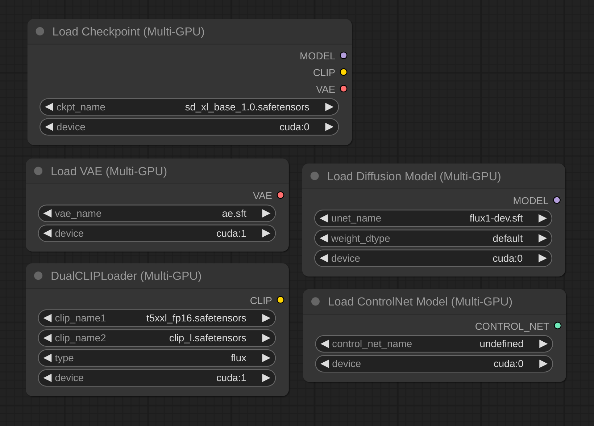

# ComfyUI-MultiGPU

### Experimental nodes for using multiple GPUs in a single ComfyUI workflow.

This extension adds new nodes for model loading that allow you to specify the GPU to use for each model. It monkey patches the memory management of ComfyUI in a hacky way and is neither a comprehensive solution nor a well-tested one. Use at your own risk.

Note that this does not add parallelism. The workflow steps are still executed sequentially just on different GPUs. Any potential speedup comes from not having to constantly load and unload models from VRAM.

## Installation

Clone this repository inside `ComfyUI/custom_nodes/`.

## Nodes

The extension adds new loader nodes corresponding to the default ones. The new nodes have the same functionality but add a new `device` parameter that allows you to specify the GPU to use.

- `CheckpointLoaderMultiGPU`
- `CLIPLoaderMultiGPU`
- `ControlNetLoaderMultiGPU`
- `DualCLIPLoaderMultiGPU`
- `UNETLoaderMultiGPU`
- `VAELoaderMultiGPU`

## Example workflows

All workflows have been tested on a 2x 3090 setup.

### Loading two SDXL checkpoints on different GPUs

- [Download](examples/sdxl_2gpu.json)

This workflow loads two SDXL checkpoints on two different GPUs. The first checkpoint is loaded on GPU 0, and the second checkpoint is loaded on GPU 1.

### Split FLUX.1-dev across two GPUs

- [Download](examples/flux1dev_2gpu.json)

This workflow loads a FLUX.1-dev model and splits it across two GPUs. The UNet model is loaded on GPU 0 while the text encoders and VAE are loaded on GPU 1.

### FLUX.1-dev and SDXL in the same workflow

- [Download](examples/flux1dev_sdxl_2gpu.json)

This workflow loads a FLUX.1-dev model and an SDXL model in the same workflow. The FLUX.1-dev model is loaded on GPU 0, and the SDXL model is loaded on GPU 1.

## Support

If you encounter problems, please [open an issue](https://github.com/neuratech-ai/ComfyUI-MultiGPU/issues/new). Attach the workflow if possible.

## Credits

Made by [Alexander Dzhoganov](https://github.com/AlexanderDzhoganov).

For business inquiries, email [sales@neuratech.io](mailto:sales@neuratech.io) or visit [our website](https://neuratech.io/).
